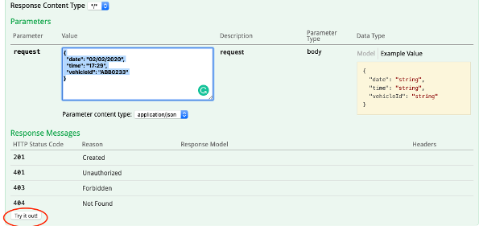
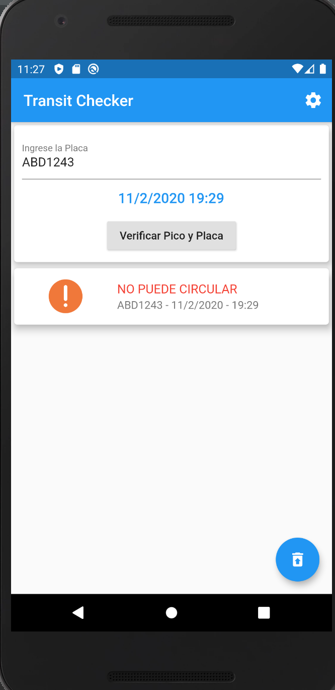
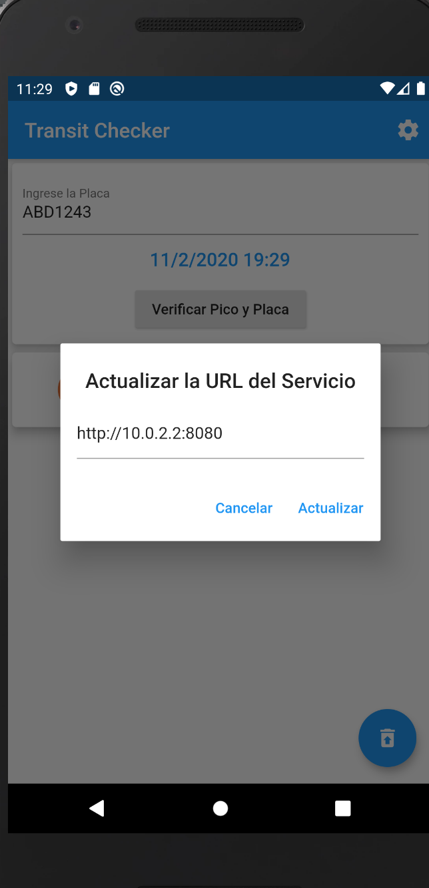

# transitchecker-service
This is the service that allows to check if the Vehicle is Allow To transit according to the  Ecuadorian "Pico y Placa" rules

#Software Requisites

* JDK 1.8 or greater
* Maven

# Build

In order to build this program, open a command line on the transitchecker-service path and execute

~~~~
  mvn spring-boot:run
~~~~

This command launch the Pico y Placa service on the port 8080

> If you need to run on a different port you can modify the src/main/resources/application.properties on the value of the server.port property

When you run this item you will be able to invoke the rest service with swagger-ui on the
following URL address:

~~~~
  http://localhost:8080/swagger-ui.html
~~~~

It will open a swagger ui with the explanation to invoke the service, please open the transit-check-controller operation, on the request field you can put the following JSON in order to invoke:

~~~~
{
  "date": "02/02/2020",
  "time": "17:29",
  "vehicleId": "ABB0233"
}
 ~~~~
 
 
 
 # Android Application
 
 Alternatively on the dist/ folder you can use an Android Application (based on Flutter) that act like a client of the service. This client takes the "Placa" the Date to verify if its allowed to go, with the service. As you can see on the pictures below, in order to configure the URL of the service on the upper right corner you can modify the value of the URL of the server (by default the URL is the Android Emulator localhost IP)
 
 
  
  
  